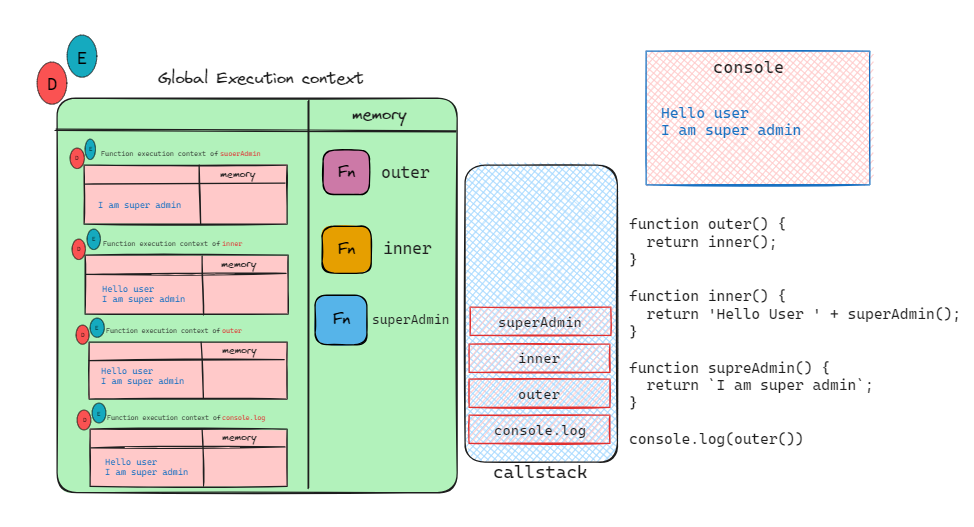

# 1. What is the difference between synchronous and asynchronous code? Explain with an example.

#### ANSWER:-)

- `Synchronous Code`:- Executes one task at a time and waits for each task to finish before moving to the next.

```js
console.log("Start");
function greet() {
  return `hey!`;
}
console.log(greet());
console.log("End");
```

- `Asynchronous Code`:- Executes tasks without waiting, allowing other tasks to run while one is in progress.

```js
console.log("Start");
setTimeout(() => {
  console.log("Done"); // this runs later
}, 1000);
console.log("End");
```

---

# 2. What is the use case of call stack?

#### ANSWER:-)

- callstack is basically used for managing at which point of time which code are running.s

---

# 3. What is API? Give example of some web browser APIs.

#### ANSWER:-)

- Application programming Interface(API) is a set of tool for building software and apps.
- Web browser APIs like the DOM (Document Object Model) API for manipulating web pages and the Geolocation API for getting a user's location.

# 4. What does single thread mean?

#### ANSWER:-)

- single thread means that at one point of time single line of code are running.

# 5. What are some of the limitations and advantages of single threaded programming language?

#### ANSWER:-)

- `Advantages`:

```js
- Runs one thing at a time, making it easier to understand
- No complicated issues with things happening at the same time.
```

- `Limitations`:

```js
- If a task takes a long time, the program might stop responding and feel slow.
- Not Good at Multitasking: If there’s a lot happening at once, it can’t handle it efficiently and may lagging.
```

---

# 6. Why call stack is a stack kind of data structure?

#### ANSWER:-)`

```js
- The call stack follows the Last-In, First-Out (LIFO) principle,meaning the last function called is the first one to finish.
- This structure helps manage function calls and returns in an organized way.
```

# 7. Create the execution context diagram (include call stack) of the code below. Also add the image for execution context in the img folder.

#### ANSWER:-)

```js
function outer() {
  return inner();
}

function inner() {
  return "Hello User " + superAdmin();
}

function supreAdmin() {
  return `I am super admin`;
}

console.log(outer());
```



# 8. Create a execution context diagram (using call stack). Test the code in the dev tools (source tab). Inspect the call stack in the sources panel. After doing that take a screenshot and add to the folder named img. Also add the image for execution context

```js
function a() {
  return "Hello " + b();
}

function b() {
  return "Wor" + c();
}
function c() {
  return "ld";
}

function final() {
  return a();
}

console.log(final());
```

#### ANSWER:-)

```js

```

# 9. What will be the output of the code below:

```js
console.log("First");
function secondCall() {
  console.log("Second");
}
secondCall();
console.log("Third");
```

#### ANSWER:-)

# 10. What will be the output of the code below and why:

```js
console.log("First");
function secondCall() {
  console.log("Second");
}
setTimeout(secondCall, 1000);
console.log("Third");
```

#### ANSWER:-)

# 11. Create a function incrementEverySecond that console logs Count is: 0 and keep incrementing the value by one every second.

```js
function incrementEverySecond() {
  // Your code goes here
}
```

Change the above function in such a way that after 5 seconds there should not be any console. Use `clearInterval`

#### ANSWER:-)

```js

```

# 12. Write a function called callItEveryXSecForYSce that will accept three arguments: a function, interval, and duration. callItEveryXSecForYSce will execute the given function every interval number of second, but then automatically stop after duration milliseconds.

```js
function callItEveryXSecForYSce(cb, interval, duration) {}

// TEST
function sayHi() {
  console.log("Hey");
}
callItEveryXSecForYSce(sayHi, 100, 1000); // should print "Hey" ten time every 100 ms
```

#### ANSWER:-)

```js

```

# 13. What will be the stack trace for the following code when it breaks.

```js
function one(z) {
  console.trace("Execution Trace");
  throw new Error();
}
function second(y) {
  one(y + 1);
}
function third(x) {
  second(x + 1);
}
third(3);
```

#### ANSWER:-)

```js

```

# 14. You can also print the stask trace of any error by using error.stack. What will be the stack trace of the error.

```js
function one(z) {
  const error = new Error();
  console.log(error.stack);
}
function second(y) {
  one(y + 1);
}
function third(x) {
  second(x + 1);
}
third(3);
```

#### ANSWER:-)

```js

```

# 15. What will happen to the call stack and execution when the code will be executed.

```js
function add() {
  add();
}
add();
```

#### ANSWER:-)

```js

```
